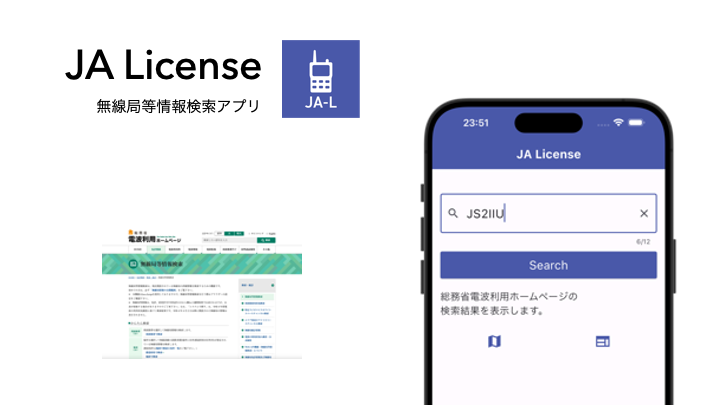

# JA License

総務省、電波利用ホームページの無線局検索をスマホから手軽に使えるようにしました。
移動運用のお供にしていだだけたら幸いです。

## 動作環境
- iOS
- Android
- MacOS
- Windows

## プライバシーポリシー
アマチュア無線局JS2IIUおよびその免許人は、提供するアプリ「JA License」の利用者に関する個人情報を含んだ情報の取り扱いについて、以下のとおりプライバシーポリシーを定めます。

- 取得する個人情報を含んだ情報
  - 本アプリケーションにおいては、個人情報を含んだ情報は一切取得いたしません

- 外部送信、第三者提供、情報収集モジュール
  - 検索履歴含め、操作の情報は一切外部送信を行いません
  - そのため、データの第三者提供を行うことはありません
  - 情報収集モジュールも使用しておりません

- お問い合わせ
  - 本アプリケーションおよびプライバシーポリシーに関する、ご意見、ご質問、苦情の申し出その他、個人情報を含んだ情報の取り扱いに関するお問い合わせは、Githubのユーザページに示すSNS経由、もしくはJARLメールにてご連絡ください。

- 改訂
  - アマチュア無線局JS2IIUの裁量に基づき、本ポリシーを変更する可能性があります。ただし、取得する個人情報を含んだ情報の取り扱いに変更が発生した場合は、本Githubリポジトリにて通知いたします。

- 制定日・改訂日
  - 制定: 2023年12月14日

## アプリ修正メモ
- 連続で検索する場合に、結果のリストが消されずに追記されてしまう
    - 変数クリアの間違いを修正
- テキストボックスで×を押した時の挙動、最初の状態に戻れるようにする
    - `ListView`で表示した内容をクリアさせるよう修正
- 小文字で入れても大文字にする
    - `TextEditingController`の`toUpperCase()`を指定
- リストの件数が多い時には下にスクロールできるようにする
    - `ListView`でラップする
- カラー指定を`Theme.of(context).colorScheme`で統一しました
- 地図が開くようにする
- QRZ.comが開くようにする
    - 地図はWebブラウザでGoogleMapsが開き、常置場所の地図を表示するようにしました。QRZ.comのコールサインページがあれば表示します。なければ、多分、QRZ.comのページがありませんページが表示されます。
- 移動運用の/P, /2などが入力されても検索できるようにしました

## 今後の追加機能
- JCCコードを表示させる
  - こちらでJCCコードが公開されている。なぜかCSVでもない、オリジナルスタイルのTXTファイルだそうです。どうしましょ・・・
  - [市郡区番号リスト](https://www.jarl.org/Japanese/A_Shiryo/A-2_jcc-jcg/jcc.htm)
- JS2IIUを入力したらピカピカさせる！？

## 参考にしたページ
- [url_launcherを使ってハマった!](https://zenn.dev/flutteruniv_dev/articles/ee377ae7f1fe05)
  - [url_launcher | Flutter Package](https://pub.dev/packages/url_launcher)
  - このページの例通りにして、`canLaunchUri`を使わなければOK
- [［Flutter］ Dartの文字列操作チートシート](https://zenn.dev/tris/articles/bf623e5e65fac3)
- [【Xcode】シミュレータのスクリーンショットを撮る方法 - Reasonable Code](https://reasonable-code.com/xcode-simulator-screenshot/)
- [アプリのプライバシーポリシー作成に際しての注意点とポイント解説 | IT弁護士 大阪│IT企業・インターネットビジネスの法律相談](https://www.ys-law.jp/IT/%E3%82%B3%E3%83%A9%E3%83%A0/%E3%82%A2%E3%83%97%E3%83%AA%E3%81%AE%E3%83%97%E3%83%A9%E3%82%A4%E3%83%90%E3%82%B7%E3%83%BC%E3%83%9D%E3%83%AA%E3%82%B7%E3%83%BC%E4%BD%9C%E6%88%90%E3%81%AB%E9%9A%9B%E3%81%97%E3%81%A6%E3%81%AE%E6%B3%A8/)
- [【Flutter】ビルド,リリース,テスターへデプロイ（Flutter,VSCode, Build, Release,Deploy,Tester）](https://isub.co.jp/flutter/flutter-dev-vscode-build-release-deploy-tester/)
- [Build and release an Android app | Flutter](https://docs.flutter.dev/deployment/android)
- [今更ながらAndroid の keystore と 署名（signingConfigs） の管理・運用について考えてみた #Android - Qiita](https://qiita.com/taki4227/items/c5685ec722a195764237)
- [【Flutter test】Flutterのテスト、チートシート│Flutter Salon](https://flutter.salon/flutter/test-cheat-sheet/)
- [［Flutter］ Androidアプリの署名｜ChisatoM](https://note.com/ewc/n/nebc9a81c082e)